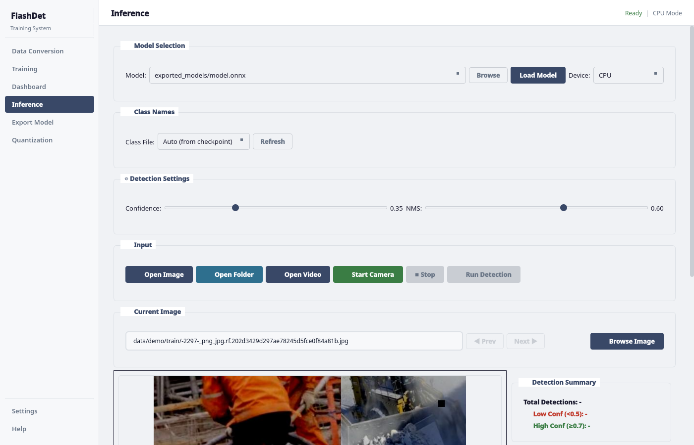
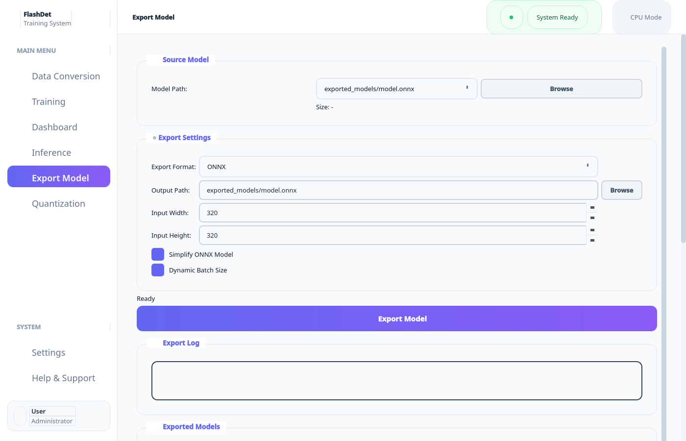
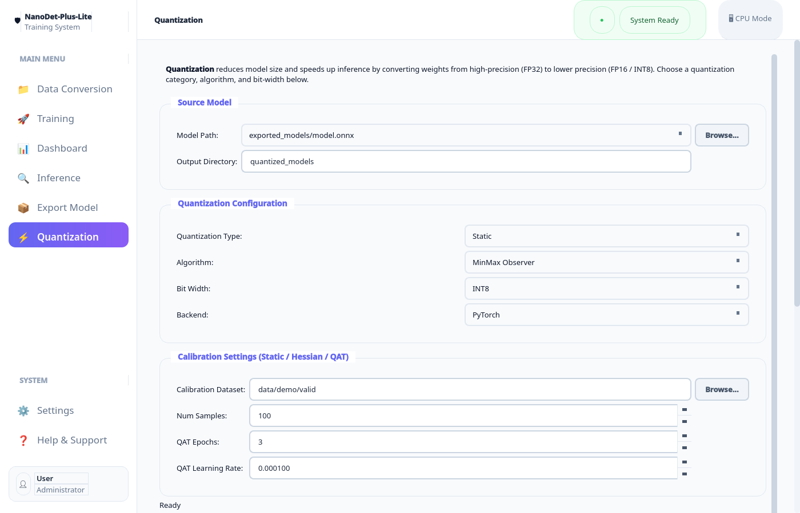

<p align="center">
  
  
  
  
  
</p>

# NanoDet-Plus-Lite

**Ultra-lightweight real-time object detection framework with modern desktop UI**

A complete end-to-end training system built on the NanoDet-Plus architecture with ShuffleNetV2 backbone. Features a modern PyQt5 desktop application for data preparation, training, monitoring, inference, and deployment - all without writing code.

---

## Highlights

- **Ultra-Lightweight**: Models from 0.49M to 2.44M parameters (0.9-4.7 MB FP16)
- **Real-Time Detection**: 100+ FPS on modern GPUs, 30+ FPS on edge devices
- **Modern Desktop UI**: Complete PyQt5 application with sidebar navigation
- **End-to-End Pipeline**: Data conversion → Training → Monitoring → Export → Quantization
- **Custom Datasets**: Train on any object detection dataset (YOLO, VOC, COCO formats)
- **Production Ready**: Export to ONNX with INT8 quantization for edge deployment

---

## Screenshots

### Data Conversion
Convert YOLO, VOC, or custom formats to COCO format for training.


### Training Configuration
Configure model size, GPU/CPU, batch size, learning rate, and start training.


### Real-Time Dashboard
Monitor training progress with live loss charts (QFL, BBox, DFL) and detection visualization.


### Inference Testing
Test trained models on images, videos, or live camera feed with detection overlay.



### Model Export
Export models to ONNX or TorchScript format with optional simplification.



### Quantization Dashboard
Quantize models to FP16/INT8 with comparison charts for size and speed trade-offs.



---

## Quick Start

### Option 1: Pre-built Executable (Easiest)

Download the pre-built executable for your platform - no Python installation required!

#### Windows
1. Download `NanoDetPlusLite_Setup.exe` from [Releases](../../releases)
2. Run the installer
3. Launch from Start Menu or Desktop shortcut

#### Linux (Ubuntu/Debian)
```bash
# Extract and run
tar -xzf NanoDetPlusLite-linux.tar.gz
cd NanoDetPlusLite
./NanoDetPlusLite
# Or: ./run.sh
```

**Optional: Create desktop shortcut**
```bash
cp nanodet-plus-lite.desktop ~/.local/share/applications/
```

### Option 2: Build from Source

#### Prerequisites

```bash
# Python 3.8+
pip install -r requirements.txt
```

#### Run Desktop UI

```bash
# Launch the PyQt5 application
./run_ui.sh
# Or: python ui/main.py
```

#### Build Executable

```bash
# Linux/Ubuntu
./scripts/build_linux.sh

# Windows (run in Command Prompt)
scripts\build_windows.bat
```

### Command Line Usage

#### 1. Prepare Dataset

A small demo dataset (64 train + 16 valid images, COCO format) is included in `data/demo/` so you can start training immediately. For your own data:

```bash
# Convert YOLO format dataset to COCO
python -c "from src.data.prepare import convert_yolo_to_coco; convert_yolo_to_coco('path/to/yolo/dataset', 'data/coco')"
```

#### 2. Train

```bash
# Quick test on the included demo dataset
python train.py --epochs 10 --batch-size 8

# Full training with GPU
python train.py --epochs 100 --batch-size 64 --device cuda

# Train on custom dataset (e.g. container number detection, 0.5x ultra-lite model)
python train.py \
  --model-size m-0.5x \
  --input-size 320 \
  --epochs 100 \
  --batch-size 16 \
  --save-dir workspace/container_num_0.5x \
  --device cuda \
  --class-file classes/container_num.txt \
  --train-images data/container_num/train \
  --val-images data/container_num/valid \
  --workers 4

# Resume training
python train.py --resume workspace/container_num_0.5x/checkpoint_latest.pth
```

#### 3. Inference

```bash
# Image
python test.py --model workspace/experiment/checkpoint_best.pth --image path/to/image.jpg

# Video
python test.py --model workspace/experiment/checkpoint_best.pth --video path/to/video.mp4

# Webcam
python test.py --model workspace/experiment/checkpoint_best.pth --camera 0
```

#### 4. Export & Quantize

```bash
# Export to ONNX
python scripts/convert_pth_to_onnx.py --checkpoint workspace/experiment/checkpoint_best.pth --output model.onnx

# INT8 Quantization
python scripts/fp16_to_int8_quantize.py --model model.onnx --output model_int8.onnx
```

---

## Project Structure

```
NanoDet-Plus-Lite/
│
├── config/                     # Configuration
│   └── config.py               # Model, Data, Training configs
│
├── data/                       # Datasets
│   └── demo/                   # Small demo dataset (included in repo)
│       ├── train/              # 64 training images + _annotations.coco.json
│       └── valid/              # 16 validation images + _annotations.coco.json
│
├── docs/                       # Documentation
│   ├── screenshots/            # UI screenshots
│   └── BUILD.md                # Build & packaging guide
│
├── scripts/                    # Utility & build scripts
│   ├── prepare_data.py         # YOLO → COCO dataset conversion
│   ├── convert_pth_to_onnx.py  # Export model to ONNX
│   ├── fp16_to_int8_quantize.py # INT8 quantization
│   ├── build_executable.py     # PyInstaller desktop app builder
│   ├── NanoDetPlusLite.spec    # PyInstaller spec file
│   ├── build_linux.sh          # Linux build script
│   ├── build_windows.bat       # Windows build script
│   └── take_screenshots.py     # Screenshot capture utility
│
├── src/                        # Core source code
│   ├── models/                 # Model architecture
│   │   ├── backbone/           # ShuffleNetV2 (0.5x / 1.0x / 1.5x)
│   │   ├── neck/               # GhostPAN feature pyramid
│   │   ├── head/               # NanoDet-Plus detection head
│   │   ├── assignment/         # Dynamic soft label assigner
│   │   └── detector.py         # NanoDetPlusLite top-level model
│   │
│   ├── losses/                 # Loss functions
│   │   ├── focal_loss.py       # Quality Focal Loss (QFL) + Distribution Focal Loss (DFL)
│   │   └── iou_loss.py         # GIoU Loss
│   │
│   ├── data/                   # Data pipeline
│   │   ├── dataset.py          # COCO dataset class
│   │   ├── dataloader.py       # DataLoader factory
│   │   ├── transforms.py       # Train/Val/Inference augmentations
│   │   └── prepare.py          # YOLO → COCO conversion helpers
│   │
│   └── utils/                  # Utilities
│       ├── visualization.py    # Bounding box drawing
│       ├── metrics.py          # mAP, IoU calculations
│       ├── checkpoint.py       # Save/load model weights
│       ├── box_utils.py        # Box coordinate operations
│       └── logger.py           # Logging setup
│
├── ui/                         # Desktop GUI (PyQt5)
│   ├── main.py                 # Main app with sidebar navigation
│   ├── tabs/                   # Feature tabs
│   │   ├── data_tab.py         # Dataset conversion
│   │   ├── training_tab.py     # Training configuration & launch
│   │   ├── dashboard_tab.py    # Live training monitoring
│   │   ├── inference_tab.py    # Image/video inference
│   │   ├── export_tab.py       # ONNX/TorchScript export
│   │   └── quantization_tab.py # INT8 quantization
│   └── widgets/                # Shared UI widgets
│
├── workspace/                  # Training experiments (auto-created, gitignored)
│
├── train.py                    # Main training entry point
├── test.py                     # Main inference entry point
├── run_ui.sh                   # Launch desktop UI
├── requirements.txt            # Python dependencies
└── .gitignore
```

---

## Model Variants

Matching official NanoDet-Plus specifications:

| Model | Backbone | FPN | Params | FP16 Size | INT8 Size | Input | Notes |
|-------|----------|-----|--------|-----------|-----------|-------|-------|
| **NanoDet-Plus-m** | ShuffleNetV2 1.0x | 96 | 1.17M | ~2.6 MB | ~1.3 MB | 320×320 / 416×416 | Official |
| **NanoDet-Plus-m-1.5x** | ShuffleNetV2 1.5x | 128 | 2.44M | ~5.2 MB | ~2.6 MB | 320×320 / 416×416 | Official |
| **NanoDet-Plus-m-0.5x** | ShuffleNetV2 0.5x | 96 | 0.49M | ~1.2 MB | ~0.6 MB | 320×320 / 416×416 | Ultra-lite |

**Note**: Sizes shown are for inference-only weights (excluding auxiliary training head). Full training checkpoints are larger as they include the aux_head and optimizer state.

### Official NanoDet-Plus Benchmarks (COCO val2017)

| Model | Input | mAP | CPU (ms) | GPU (ms) | GFLOPs |
|-------|-------|-----|----------|----------|--------|
| NanoDet-Plus-m | 320×320 | 27.0 | 11.97 | 5.25 | 0.9 |
| NanoDet-Plus-m | 416×416 | 30.4 | 19.77 | 8.32 | 1.52 |
| NanoDet-Plus-m-1.5x | 320×320 | 29.9 | 15.90 | 7.21 | 1.75 |
| NanoDet-Plus-m-1.5x | 416×416 | 34.1 | 25.49 | 11.50 | 2.97 |

---

## Architecture

```
Input (320×320×3)
    │
    ▼
┌─────────────────────────────────────────┐
│         ShuffleNetV2 Backbone           │
│  ┌─────┐ ┌─────┐ ┌─────┐ ┌─────┐       │
│  │ C1  │→│ C2  │→│ C3  │→│ C4  │       │
│  │1/2  │ │1/4  │ │1/8  │ │1/16 │       │
│  └─────┘ └─────┘ └──┬──┘ └──┬──┘       │
└─────────────────────┼───────┼──────────┘
                      │       │
    ┌─────────────────┼───────┼──────────┐
    │           GhostPAN Neck            │
    │  ┌─────────────────────────────┐   │
    │  │    Top-down + Bottom-up     │   │
    │  │    Feature Pyramid Network  │   │
    │  └─────────────────────────────┘   │
    │       │         │         │        │
    │     P3(40)    P4(80)    P5(160)    │
    └───────┼─────────┼─────────┼────────┘
            │         │         │
    ┌───────┼─────────┼─────────┼────────┐
    │       ▼         ▼         ▼        │
    │   ┌───────┐ ┌───────┐ ┌───────┐   │
    │   │ Head  │ │ Head  │ │ Head  │   │
    │   │ 40×40 │ │ 20×20 │ │ 10×10 │   │
    │   └───┬───┘ └───┬───┘ └───┬───┘   │
    │       │         │         │        │
    │       ▼         ▼         ▼        │
    │   Classification + Box Regression  │
    │   (Quality Focal Loss + GIoU/DFL)  │
    └────────────────────────────────────┘
            │
            ▼
    ┌────────────────┐
    │   NMS + Post   │
    │   Processing   │
    └────────────────┘
            │
            ▼
    Detections [x1, y1, x2, y2, score, class]
```

---

## Training Features

### Loss Functions
- **Quality Focal Loss (QFL)**: Joint classification and IoU quality prediction
- **Generalized IoU Loss (GIoU)**: Better box regression than L1/L2
- **Distribution Focal Loss (DFL)**: Flexible localization distribution

### Data Augmentation
- Random horizontal flip
- Random scale (0.5x - 1.5x)
- Color jittering (brightness, contrast, saturation)
- Mosaic augmentation (4-image combination)

### Training Strategies
- Cosine annealing learning rate schedule
- Warmup epochs for stable training
- Gradient clipping for stability
- Mixed precision training (FP16)

---

## Supported Dataset Formats

| Format | Description |
|--------|-------------|
| **YOLO** | `.txt` files with `class cx cy w h` (normalized) |
| **Pascal VOC** | XML annotations with bounding boxes |
| **COCO** | JSON annotations (native format) |
| **Custom** | Convert via UI or write custom converter |

The UI provides one-click conversion from YOLO/VOC to COCO format.

---

## Export & Deployment

### ONNX Export
```python
# From UI or command line
python scripts/convert_pth_to_onnx.py \
    --checkpoint workspace/experiment/checkpoint_best.pth \
    --output model.onnx \
    --simplify
```

### Quantization Options

| Type | Size Reduction | Speed Improvement | Accuracy Loss |
|------|---------------|-------------------|---------------|
| FP16 | ~2x | 1.5-2x | < 0.5% |
| INT8 Dynamic | ~4x | 2-3x | 1-2% |
| INT8 Static | ~4x | 3-4x | 1-2% |

### Deployment Targets
- **Edge Devices**: Raspberry Pi, Jetson Nano/Xavier, Intel NCS
- **Mobile**: Android (NCNN), iOS (CoreML)
- **Web**: ONNX.js, TensorFlow.js
- **Server**: TensorRT, OpenVINO, ONNX Runtime

---

## UI Features

### Modern Design
- Clean sidebar navigation
- Card-based layout with shadows
- Responsive with proper scaling
- Dark terminal theme for logs

### Real-Time Monitoring
- Live loss charts updated per batch
- Iteration and epoch views
- Training visualization preview
- Checkpoint management

### One-Click Operations
- Dataset conversion with progress
- Training start/stop
- Model export to ONNX
- Batch quantization

---

## Example Use Cases

NanoDet-Plus-Lite can be trained for various object detection tasks:

- **Safety Monitoring**: PPE detection, hazard identification
- **Autonomous Vehicles**: Traffic signs, pedestrians, vehicles
- **Retail**: Product detection, shelf monitoring
- **Agriculture**: Crop detection, pest identification
- **Medical**: Cell detection, anomaly detection
- **Industrial**: Defect detection, part counting
- **Wildlife**: Animal detection, species identification
- **Sports**: Player tracking, ball detection

---

## Requirements

```
torch>=1.10.0
torchvision>=0.11.0
PyQt5>=5.15.0
opencv-python>=4.5.0
matplotlib>=3.5.0
numpy>=1.20.0
Pillow>=8.0.0
onnx>=1.10.0
onnxruntime>=1.15.0
pycocotools>=2.0.0
```

See [requirements.txt](requirements.txt) for the full list including optional dependencies.

---

## References

- [NanoDet](https://github.com/RangiLyu/nanodet) - Original NanoDet implementation
- [ShuffleNetV2](https://arxiv.org/abs/1807.11164) - Efficient backbone architecture
- [GhostNet](https://arxiv.org/abs/1911.11907) - Ghost modules for efficiency
- [Generalized Focal Loss](https://arxiv.org/abs/2006.04388) - QFL and DFL losses

---

## License

MIT License - see [LICENSE](LICENSE) for details.

---

## Citation

```bibtex
@software{nanodet_plus_lite,
  title={NanoDet-Plus-Lite: Ultra-lightweight Object Detection Framework},
  author={Gaurav Goswami},
  year={2024},
  url={https://github.com/GauravGoswami/NanoDet-Plus-Lite}
}
```
