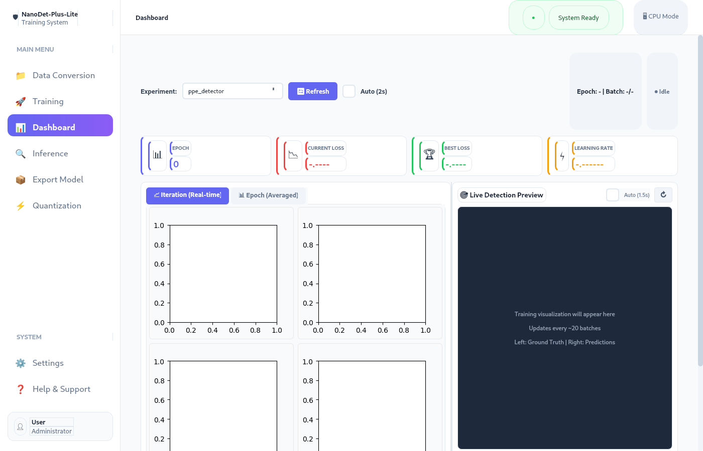

<p align="center">
  
  
  
  
  
</p>

# NanoDet-Plus-Lite

**Ultra-lightweight real-time object detection for Construction Site Safety**

A complete training system with modern desktop UI for detecting PPE (Personal Protective Equipment) compliance and safety violations at construction sites. Built on the NanoDet-Plus architecture with ShuffleNetV2 backbone for edge deployment.

---

## Highlights

- **Ultra-Lightweight**: Models from 0.95M to 6.2M parameters (1-25 MB)
- **Real-Time Detection**: 100+ FPS on modern GPUs, 30+ FPS on edge devices
- **Modern Desktop UI**: Complete PyQt5 application with sidebar navigation
- **End-to-End Pipeline**: Data conversion → Training → Monitoring → Export → Quantization
- **10 Safety Classes**: Detect hardhats, masks, safety vests, and violations
- **Production Ready**: Export to ONNX with INT8 quantization for deployment

---

## Screenshots

### Data Conversion
Convert YOLO, VOC, or custom formats to COCO format for training.


### Training Configuration
Configure model size, GPU/CPU, batch size, learning rate, and start training.


### Real-Time Dashboard
Monitor training progress with live loss charts (QFL, BBox, DFL) and detection visualization.



### Inference Testing
Test trained models on images, videos, or live camera feed with detection overlay.


### Model Export
Export models to ONNX or TorchScript format with optional simplification.


### Quantization Dashboard
Quantize models to FP16/INT8 with comparison charts for size and speed trade-offs.


---

## Quick Start

### Prerequisites

```bash
# Python 3.8+
pip install -r requirements.txt
```

### Option 1: Desktop UI (Recommended)

```bash
# Launch the PyQt5 application
./run_ui.sh
# Or: python ui/main.py
```

### Option 2: Command Line

#### 1. Prepare Dataset

```bash
# Download from Kaggle
kaggle datasets download -d snehilsanyal/construction-site-safety-image-dataset-roboflow
unzip *.zip -d dataset_raw/css-data

# Convert to COCO format
python -c "from src.data.prepare import convert_yolo_to_coco; convert_yolo_to_coco('dataset_raw/css-data', 'dataset_coco')"
```

#### 2. Train

```bash
# Basic training
python train.py --epochs 100 --batch-size 32

# With GPU
python train.py --epochs 100 --batch-size 64 --device cuda

# Resume training
python train.py --resume workspace/ppe_detector/checkpoint_latest.pth
```

#### 3. Inference

```bash
# Image
python test.py --model workspace/ppe_detector/checkpoint_best.pth --image samples/sample.jpg

# Video
python test.py --model workspace/ppe_detector/checkpoint_best.pth --video samples/video.mp4

# Webcam
python test.py --model workspace/ppe_detector/checkpoint_best.pth --camera 0
```

#### 4. Export & Quantize

```bash
# Export to ONNX
python scripts/convert_pth_to_onnx.py --checkpoint workspace/ppe_detector/checkpoint_best.pth --output model.onnx

# INT8 Quantization
python scripts/fp16_to_int8_quantize.py --model model.onnx --output model_int8.onnx
```

---

## Project Structure

```
NanoDet-Plus-Lite/
│
├── ui/                         # Desktop UI (PyQt5)
│   ├── main.py                 # Main application with sidebar navigation
│   └── tabs/                   # UI tabs
│       ├── data_tab.py         # Data format conversion
│       ├── training_tab.py     # Training configuration
│       ├── dashboard_tab.py    # Live training monitoring
│       ├── inference_tab.py    # Image/video testing
│       ├── export_tab.py       # ONNX/TorchScript export
│       └── quantization_tab.py # Model quantization
│
├── config/                     # Configuration
│   └── config.py               # Model, Data, Training configs
│
├── src/                        # Source code
│   ├── models/                 # Model architecture
│   │   ├── backbone/           # ShuffleNetV2
│   │   ├── neck/               # GhostPAN
│   │   ├── head/               # NanoDet detection head
│   │   ├── assignment/         # Dynamic soft label assignment
│   │   └── detector.py         # NanoDetPlusLite main model
│   │
│   ├── losses/                 # Loss functions
│   │   ├── focal_loss.py       # Quality Focal Loss
│   │   ├── iou_loss.py         # GIoU Loss
│   │   └── dfl_loss.py         # Distribution Focal Loss
│   │
│   ├── data/                   # Data handling
│   │   ├── dataset.py          # PPEDataset
│   │   ├── dataloader.py       # DataLoader
│   │   ├── transforms.py       # Augmentations
│   │   └── prepare.py          # YOLO→COCO conversion
│   │
│   └── utils/                  # Utilities
│       ├── visualization.py    # Drawing utilities
│       ├── metrics.py          # mAP, IoU calculations
│       ├── checkpoint.py       # Save/Load models
│       └── box_utils.py        # Box operations
│
├── scripts/                    # Utility scripts
│   ├── convert_pth_to_onnx.py  # Export to ONNX
│   └── fp16_to_int8_quantize.py # Quantization
│
├── screenshots/                # UI screenshots
├── train.py                    # Training script
├── test.py                     # Inference script
├── run_ui.sh                   # Launch UI
└── requirements.txt            # Dependencies
```

---

## Detection Classes

| ID | Class | Type | Color |
|----|-------|------|-------|
| 0 | Hardhat | ✅ Safe | Green |
| 1 | Mask | ✅ Safe | Green |
| 2 | NO-Hardhat | ❌ Violation | Red |
| 3 | NO-Mask | ❌ Violation | Red |
| 4 | NO-Safety Vest | ❌ Violation | Red |
| 5 | Person | Detection | Yellow |
| 6 | Safety Cone | Object | Orange |
| 7 | Safety Vest | ✅ Safe | Green |
| 8 | machinery | Object | Purple |
| 9 | vehicle | Object | Cyan |

---

## Model Variants

| Model | Backbone | Params | FP32 Size | INT8 Size | Input | Speed (GPU) |
|-------|----------|--------|-----------|-----------|-------|-------------|
| **Nano** | ShuffleNetV2 0.5x | 0.95M | ~4 MB | ~1 MB | 320×320 | 150+ FPS |
| **Small** | ShuffleNetV2 0.5x | 1.8M | ~7 MB | ~2 MB | 320×320 | 120+ FPS |
| **Medium** | ShuffleNetV2 1.0x | 3.5M | ~14 MB | ~4 MB | 416×416 | 80+ FPS |
| **Large** | ShuffleNetV2 1.0x | 6.2M | ~25 MB | ~7 MB | 416×416 | 60+ FPS |

---

## Architecture

```
Input (320×320×3)
    │
    ▼
┌─────────────────────────────────────────┐
│         ShuffleNetV2 Backbone           │
│  ┌─────┐ ┌─────┐ ┌─────┐ ┌─────┐       │
│  │ C1  │→│ C2  │→│ C3  │→│ C4  │       │
│  │1/2  │ │1/4  │ │1/8  │ │1/16 │       │
│  └─────┘ └─────┘ └──┬──┘ └──┬──┘       │
└─────────────────────┼───────┼──────────┘
                      │       │
    ┌─────────────────┼───────┼──────────┐
    │           GhostPAN Neck            │
    │  ┌─────────────────────────────┐   │
    │  │    Top-down + Bottom-up     │   │
    │  │    Feature Pyramid Network  │   │
    │  └─────────────────────────────┘   │
    │       │         │         │        │
    │     P3(40)    P4(80)    P5(160)    │
    └───────┼─────────┼─────────┼────────┘
            │         │         │
    ┌───────┼─────────┼─────────┼────────┐
    │       ▼         ▼         ▼        │
    │   ┌───────┐ ┌───────┐ ┌───────┐   │
    │   │ Head  │ │ Head  │ │ Head  │   │
    │   │ 40×40 │ │ 20×20 │ │ 10×10 │   │
    │   └───┬───┘ └───┬───┘ └───┬───┘   │
    │       │         │         │        │
    │       ▼         ▼         ▼        │
    │   Classification + Box Regression  │
    │   (Quality Focal Loss + GIoU/DFL)  │
    └────────────────────────────────────┘
            │
            ▼
    ┌────────────────┐
    │   NMS + Post   │
    │   Processing   │
    └────────────────┘
            │
            ▼
    Detections [x1, y1, x2, y2, score, class]
```

---

## Training Features

### Loss Functions
- **Quality Focal Loss (QFL)**: Joint classification and IoU quality prediction
- **Generalized IoU Loss (GIoU)**: Better box regression than L1/L2
- **Distribution Focal Loss (DFL)**: Flexible localization distribution

### Data Augmentation
- Random horizontal flip
- Random scale (0.5x - 1.5x)
- Color jittering (brightness, contrast, saturation)
- Mosaic augmentation (4-image combination)

### Training Strategies
- Cosine annealing learning rate schedule
- Warmup epochs for stable training
- Gradient clipping for stability
- Mixed precision training (FP16)

---

## Export & Deployment

### ONNX Export
```python
# From UI or command line
python scripts/convert_pth_to_onnx.py \
    --checkpoint workspace/ppe_detector/checkpoint_best.pth \
    --output model.onnx \
    --simplify
```

### Quantization Options

| Type | Size Reduction | Speed Improvement | Accuracy Loss |
|------|---------------|-------------------|---------------|
| FP16 | ~2x | 1.5-2x | < 0.5% |
| INT8 Dynamic | ~4x | 2-3x | 1-2% |
| INT8 Static | ~4x | 3-4x | 1-2% |

### Deployment Targets
- **Edge Devices**: Raspberry Pi, Jetson Nano/Xavier
- **Mobile**: Android (NCNN), iOS (CoreML)
- **Web**: ONNX.js, TensorFlow.js
- **Server**: TensorRT, OpenVINO, ONNX Runtime

---

## UI Features

### Modern Design
- Clean sidebar navigation
- Card-based layout with shadows
- Responsive with proper scaling
- Dark terminal theme for logs

### Real-Time Monitoring
- Live loss charts updated per batch
- Iteration and epoch views
- Training visualization preview
- Checkpoint management

### One-Click Operations
- Dataset conversion with progress
- Training start/stop
- Model export to ONNX
- Batch quantization

---

## Requirements

```
torch>=2.0.0
torchvision>=0.15.0
PyQt5>=5.15.0
opencv-python>=4.5.0
matplotlib>=3.5.0
numpy>=1.21.0
Pillow>=9.0.0
onnx>=1.12.0
onnxruntime>=1.12.0
onnxsim>=0.4.0
```

---

## References

- [NanoDet](https://github.com/RangiLyu/nanodet) - Original NanoDet implementation
- [ShuffleNetV2](https://arxiv.org/abs/1807.11164) - Efficient backbone architecture
- [GhostNet](https://arxiv.org/abs/1911.11907) - Ghost modules for efficiency
- [Generalized Focal Loss](https://arxiv.org/abs/2006.04388) - QFL and DFL losses
- [CSS Dataset](https://www.kaggle.com/datasets/snehilsanyal/construction-site-safety-image-dataset-roboflow) - Training data

---

## License

MIT License - see [LICENSE](LICENSE) for details.

---

## Citation

```bibtex
@software{nanodet_plus_lite,
  title={NanoDet-Plus-Lite: Ultra-lightweight Object Detection for Construction Site Safety},
  author={Gaurav Goswami},
  year={2024},
  url={https://github.com/username/NanoDet-Plus-Lite}
}
```
