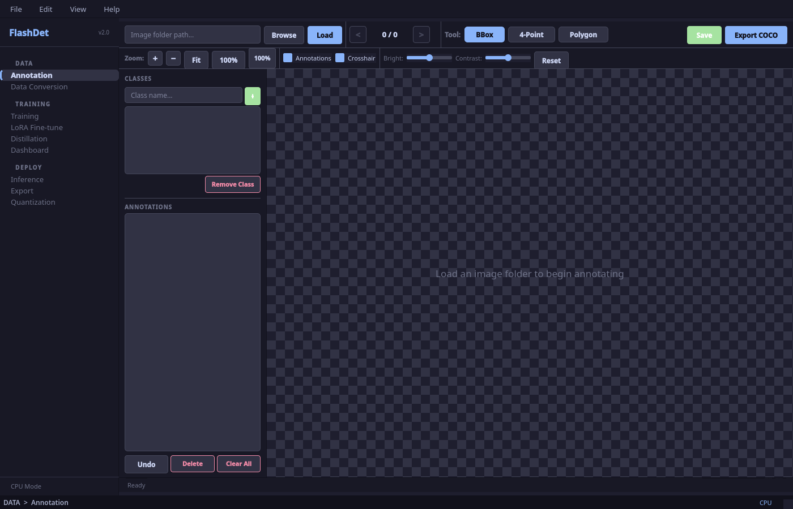
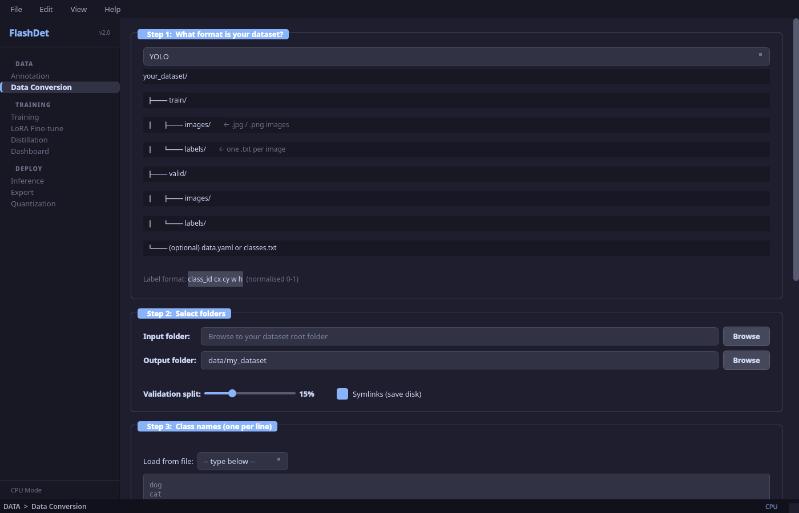
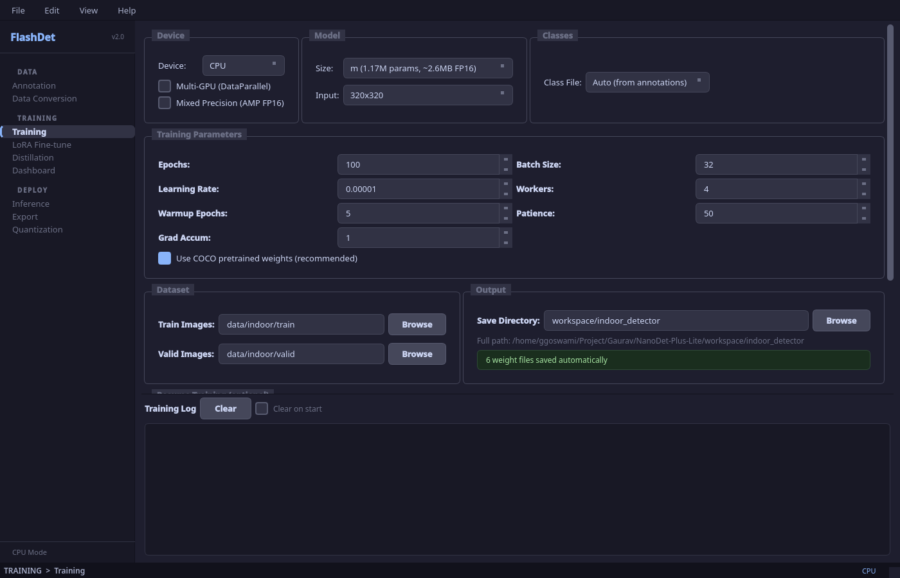
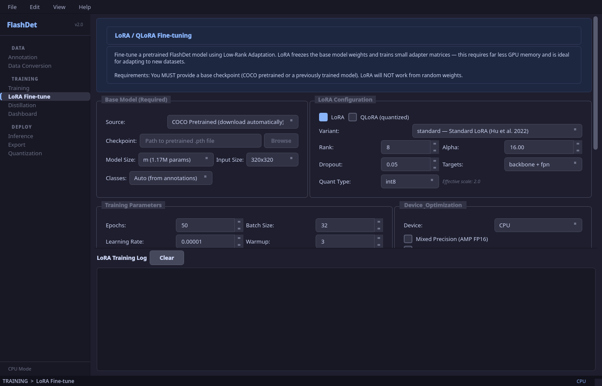
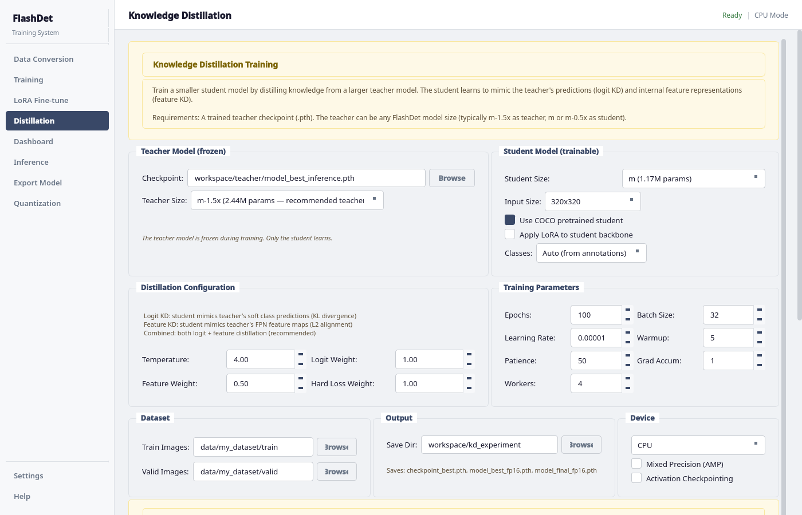
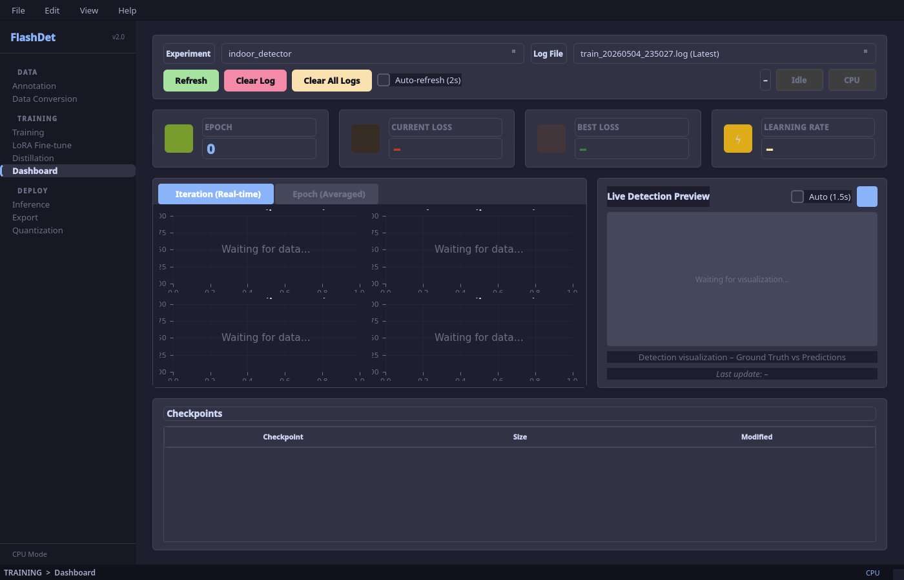
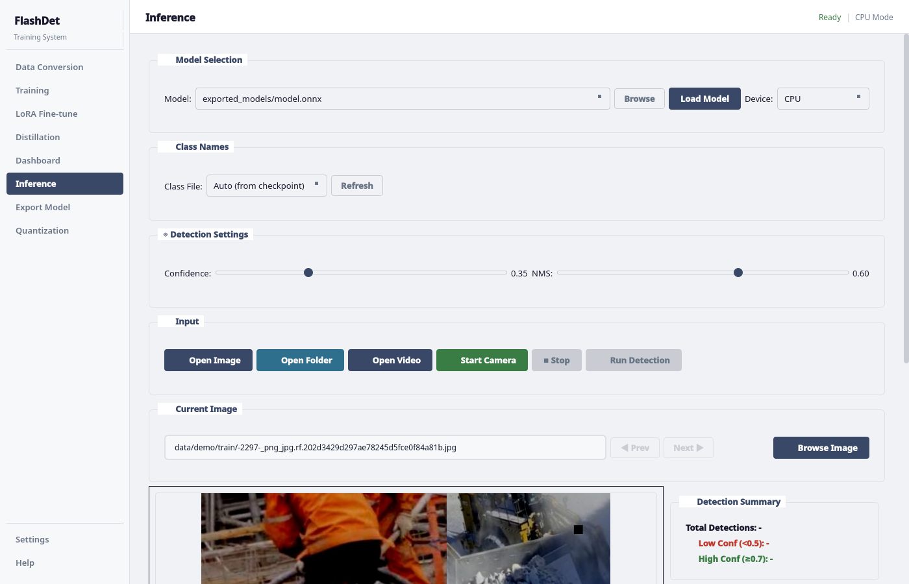
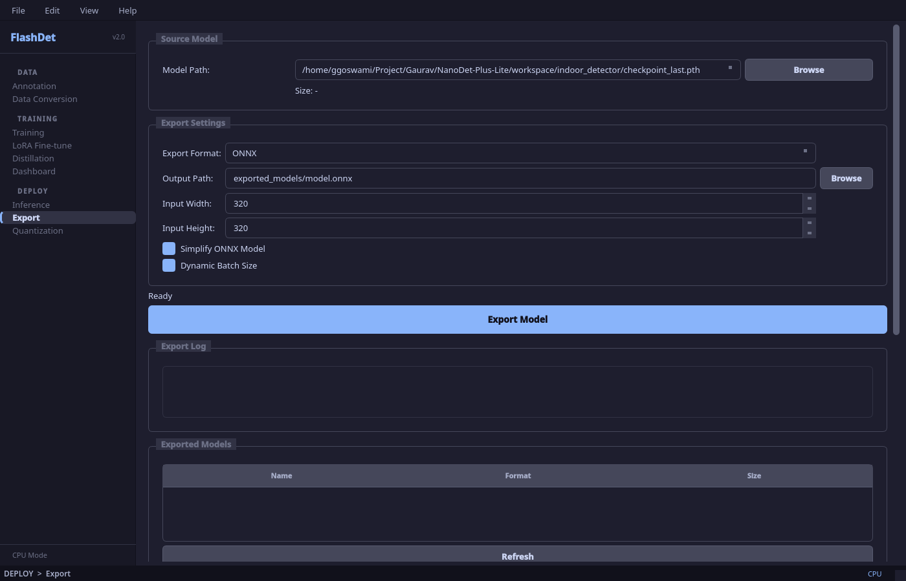
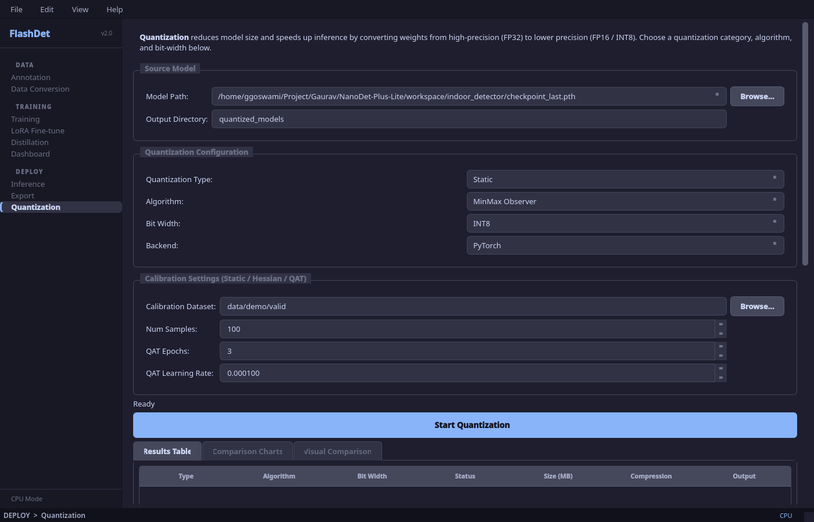

<p align="center">
  
  
  
  
  
  
  
</p>

<h1 align="center">FlashDet</h1>

<p align="center">
  <b>Ultra-lightweight real-time object detection with LoRA fine-tuning, Knowledge Distillation, and a full desktop UI</b><br>
  Train, distill, fine-tune, monitor, test, export, and quantize — all from a single application.
</p>

---

## What is this?

FlashDet is an end-to-end object detection system based on the [NanoDet-Plus](https://github.com/RangiLyu/nanodet) architecture with a ShuffleNetV2 backbone. It ships with a modern PyQt5 desktop application that covers the entire workflow — from dataset conversion to INT8 quantized deployment — without writing a single line of code. It also integrates advanced training techniques inspired by [torchtune](https://github.com/meta-pytorch/torchtune): **LoRA/QLoRA** for parameter-efficient fine-tuning and **Knowledge Distillation** for training compact student models from larger teachers.

### Key Features

- **Ultra-Lightweight** — 0.49M to 2.44M parameters (0.9 – 4.7 MB FP16)
- **Real-Time** — 100+ FPS on GPU, 30+ FPS on edge devices
- **LoRA / QLoRA Fine-Tuning** — Freeze the backbone, train only low-rank adapters; QLoRA adds INT8/NF4 quantization of frozen weights for even lower memory
- **Knowledge Distillation** — Train a small student model from a larger teacher using logit + feature distillation with configurable temperature and loss weights
- **Full Desktop UI** — Sidebar navigation, live charts, visual comparison tools — including LoRA/KD configuration panels
- **End-to-End** — Data conversion &rarr; Training &rarr; Dashboard &rarr; Inference &rarr; Export &rarr; Quantization
- **Multiple Formats** — Import from YOLO / VOC / COCO, export to ONNX
- **Advanced Quantization** — Static, Dynamic, QAT, Hessian-based with side-by-side visual comparison
- **Mixed Precision & Multi-GPU** — AMP (FP16) training with DataParallel support
- **COCO Pretrained Weights** — Auto-download official pretrained checkpoints for transfer learning

---

## Screenshots

> Catppuccin Mocha dark theme — deep navy base with warm pastel accents.

<table>
  <tr>
    <td align="center"><b>Annotation</b></td>
    <td align="center"><b>Data Conversion</b></td>
  </tr>
  <tr>
    <td></td>
    <td></td>
  </tr>
  <tr>
    <td>Full-featured image annotation tool with bounding box, four-point, and polygon drawing. Zoom, pan, brightness/contrast, crosshair, undo, and COCO JSON export.</td>
    <td>Convert YOLO, VOC, or custom formats to COCO with a validation split slider and class name editor.</td>
  </tr>
</table>

<table>
  <tr>
    <td align="center"><b>Training</b></td>
    <td align="center"><b>LoRA Fine-tuning</b></td>
  </tr>
  <tr>
    <td></td>
    <td></td>
  </tr>
  <tr>
    <td>Configure device, model size, hyperparameters, dataset paths, and resume from checkpoint.</td>
    <td>Dedicated LoRA/QLoRA dashboard with variant selection (Standard, DoRA, LoRA+, AdaLoRA, OrthoLoRA, LoRA-FA), rank/alpha/dropout controls, target module selection, and memory estimates.</td>
  </tr>
</table>

<table>
  <tr>
    <td align="center"><b>Knowledge Distillation</b></td>
    <td align="center"><b>Real-Time Dashboard</b></td>
  </tr>
  <tr>
    <td></td>
    <td></td>
  </tr>
  <tr>
    <td>Teacher-student distillation with configurable temperature, logit/feature loss weights, teacher checkpoint selection, and student architecture options.</td>
    <td>Live loss charts (Total, QFL, BBox, DFL), epoch/iteration views, learning rate tracking, and detection preview.</td>
  </tr>
</table>

<table>
  <tr>
    <td align="center"><b>Inference</b></td>
    <td align="center"><b>Model Export</b></td>
  </tr>
  <tr>
    <td></td>
    <td></td>
  </tr>
  <tr>
    <td>Test on images, folders, videos, or live camera. Supports both <code>.pth</code> and <code>.onnx</code> models. Adjustable confidence and NMS thresholds with detection summary.</td>
    <td>Export to ONNX with optional graph simplification and dynamic batch size. View exported model metadata.</td>
  </tr>
</table>

<table>
  <tr>
    <td align="center" colspan="2"><b>Quantization + Visual Comparison</b></td>
  </tr>
  <tr>
    <td colspan="2"></td>
  </tr>
  <tr>
    <td colspan="2">Static / Dynamic / QAT / Hessian quantization with algorithm selection, calibration settings, comparison charts, and visual side-by-side inference.</td>
  </tr>
</table>

---

## Quick Start

### Option 1: Pre-built Executable

Download the pre-built binary for your platform — no Python required.

**Windows**
1. Download `FlashDet_Setup.exe` from [Releases](../../releases)
2. Run the installer
3. Launch from the Start Menu

**Linux**
```bash
tar -xzf FlashDet-linux.tar.gz
cd FlashDet && ./FlashDet
```

### Option 2: Run from Source (Recommended)

```bash
# Clone
git clone https://github.com/GauravGoswami/NanoDet-Plus-Lite.git FlashDet
cd FlashDet

# One-command setup — creates venv, installs correct PyTorch + all deps
bash setup_env.sh              # auto-detects GPU
# bash setup_env.sh --cpu      # force CPU-only
# bash setup_env.sh --cuda 12.4  # force specific CUDA version

# Activate the environment
source venv/bin/activate

# Launch the UI
python ui/main.py          # or: ./run_ui.sh
```

<details>
<summary><b>Manual setup (if you prefer)</b></summary>

```bash
python3 -m venv venv && source venv/bin/activate

# Install PyTorch (pick ONE):
pip install torch torchvision --index-url https://download.pytorch.org/whl/cpu      # CPU
pip install torch torchvision --index-url https://download.pytorch.org/whl/cu118     # CUDA 11.8
pip install torch torchvision --index-url https://download.pytorch.org/whl/cu124     # CUDA 12.x

# Install project dependencies
pip install -r requirements.txt
```

</details>

### Option 3: Command Line

```bash
# Train on the included demo dataset
python train.py --epochs 50 --batch-size 16 --device cuda

# Train on a custom dataset (0.5x ultra-lite model)
python train.py \
  --model-size m-0.5x \
  --input-size 320 \
  --epochs 100 \
  --batch-size 16 \
  --save-dir workspace/my_project \
  --device cuda \
  --class-file classes/my_classes.txt \
  --train-images data/my_dataset/train \
  --val-images data/my_dataset/valid

# LoRA fine-tuning (parameter-efficient)
python train.py --lora --lora-rank 8 --epochs 50 --device cuda

# Knowledge Distillation (teacher → student)
python train_kd.py \
  --teacher-checkpoint workspace/teacher/best.pth \
  --teacher-size m-1.5x \
  --model-size m-0.5x \
  --kd-temperature 4.0 \
  --epochs 100 --device cuda

# Inference
python test.py --model workspace/my_project/checkpoint_best.pth --image photo.jpg

# Export to ONNX
python scripts/convert_pth_to_onnx.py \
  --checkpoint workspace/my_project/checkpoint_best.pth \
  --output model.onnx --simplify

# INT8 quantization
python scripts/fp16_to_int8_quantize.py --model model.onnx --output model_int8.onnx
```

---

## Model Variants

| Model | Backbone | FPN | Params | FP16 Size | INT8 Size | Input |
|-------|----------|-----|--------|-----------|-----------|-------|
| **m-0.5x** | ShuffleNetV2 0.5x | 96 | 0.49M | ~1.2 MB | ~0.6 MB | 320 |
| **m** (default) | ShuffleNetV2 1.0x | 96 | 1.17M | ~2.6 MB | ~1.3 MB | 320 / 416 |
| **m-1.5x** | ShuffleNetV2 1.5x | 128 | 2.44M | ~5.2 MB | ~2.6 MB | 320 / 416 |

### COCO val2017 Benchmarks (official NanoDet-Plus numbers)

| Model | Input | mAP | CPU (ms) | GPU (ms) | GFLOPs |
|-------|-------|-----|----------|----------|--------|
| m | 320 | 27.0 | 11.97 | 5.25 | 0.9 |
| m | 416 | 30.4 | 19.77 | 8.32 | 1.52 |
| m-1.5x | 320 | 29.9 | 15.90 | 7.21 | 1.75 |
| m-1.5x | 416 | 34.1 | 25.49 | 11.50 | 2.97 |

---

## Architecture

```
Input (320x320x3)
       |
  ShuffleNetV2 Backbone (0.5x / 1.0x / 1.5x)
   C2 ──── C3 ──── C4
       |
  GhostPAN Neck (top-down + bottom-up FPN)
   P3 ──── P4 ──── P5
       |
  FlashDet detection head (based on NanoDet-Plus; per-level classification + regression)
   QFL + GIoU + DFL losses
       |
  NMS + Post-processing
       |
  Detections [x1, y1, x2, y2, score, class]
```

---

## UI Features at a Glance

| Tab | What it does |
|-----|-------------|
| **Annotation** | Full-featured image annotation tool. Bounding box, four-point quadrilateral, and polygon drawing. Zoom/pan, brightness/contrast, crosshair, undo, and COCO JSON export. |
| **Data Conversion** | Convert YOLO / VOC / custom formats to COCO. Validation split slider, class name editor, symlink option, annotation viewer. |
| **Training** | Configure device (CPU/GPU/multi-GPU), model size (0.5x/1.0x/1.5x), hyperparameters (LR, batch, warmup, patience, grad accum), AMP, resume from checkpoint, COCO pretrained init. |
| **LoRA Fine-tune** | Dedicated LoRA/QLoRA dashboard. Select variant (Standard, DoRA, LoRA+, AdaLoRA, OrthoLoRA, LoRA-FA), configure rank/alpha/dropout, choose target modules, select base checkpoint, view memory estimates. |
| **Distillation** | Knowledge Distillation dashboard. Select teacher checkpoint and size, configure temperature, logit/feature loss weights, hard loss weight. Supports LoRA on student and activation checkpointing. |
| **Dashboard** | Live loss charts (Total, QFL, BBox, DFL) updated per batch. Epoch vs iteration views, LR tracking, live detection preview from workspace. Auto-discovers experiments. |
| **Inference** | Load `.pth` or `.onnx` model. Test on single images, folders, video files, or live webcam. Confidence/NMS sliders, detection summary table, FPS counter, zoom/pan support. |
| **Export Model** | Export to ONNX with optional graph simplification, dynamic batch size, and input size selection. View exported model metadata. |
| **Quantization** | Static, Dynamic, QAT, and Hessian-based quantization. Multiple algorithms per type (MinMax, Histogram, Entropy, MSE, Per-Channel, Fisher, etc.). Comparison charts (size, speed, accuracy). **Visual Comparison** tool runs both original and quantized models side-by-side on the same image. |

---

## Supported Dataset Formats

| Format | Description |
|--------|-------------|
| **YOLO** | `.txt` label files with `class cx cy w h` (normalised 0–1) |
| **Pascal VOC** | XML annotations with bounding boxes |
| **COCO** | JSON annotations (native format — no conversion needed) |

The UI converts YOLO and VOC to COCO format automatically.

---

## Quantization Options

| Type | Algorithms | Size Reduction | Speed-up | Accuracy Loss |
|------|-----------|---------------|----------|---------------|
| **Static** | MinMax, Histogram, Entropy, MSE, Per-Channel | ~4x | 3–4x | 1–2% |
| **Dynamic** | PyTorch Dynamic, ONNX Runtime Dynamic | ~2–4x | 2–3x | 1–2% |
| **QAT** | Default QAT, Per-Channel QAT | ~4x | 3–4x | < 1% |
| **Hessian-based** | Layer Sensitivity, Fisher Information | ~4x | 3–4x | < 1% |

The Quantization tab includes a **Visual Comparison** tool that runs both the original and quantized model on the same images side-by-side, showing match rate, IoU, confidence changes, and latency.

---

## Export & Deployment Targets

| Target | Format | Notes |
|--------|--------|-------|
| Edge (Raspberry Pi, Jetson) | ONNX INT8 | Use static quantization with calibration data |
| Mobile (Android) | ONNX / NCNN | Convert ONNX to NCNN for best performance |
| Server | ONNX Runtime / TensorRT | FP16 or INT8 with dynamic batching |
| Web | ONNX.js / TF.js | Convert ONNX to TF.js for browser inference |
| Intel | OpenVINO | Direct ONNX import |

---

## Project Structure

```
FlashDet/
├── config/                     # Model, data, training configuration
├── data/demo/                  # Included demo dataset (64 train + 16 valid)
├── docs/screenshots/           # UI screenshots for README
├── scripts/
│   ├── prepare_data.py         # YOLO → COCO conversion
│   ├── convert_pth_to_onnx.py  # Export to ONNX
│   ├── fp16_to_int8_quantize.py# INT8 quantization
│   ├── build_executable.py     # PyInstaller packaging
│   ├── take_screenshots.py     # Capture UI screenshots
│   ├── build_linux.sh          # Linux build script
│   └── build_windows.bat       # Windows build script
├── src/
│   ├── models/
│   │   ├── backbone/           # ShuffleNetV2 (0.5x / 1.0x / 1.5x)
│   │   ├── neck/               # GhostPAN feature pyramid
│   │   ├── head/               # FlashDet detection head + aux head
│   │   ├── assignment/         # Dynamic soft label assigner
│   │   ├── lora.py             # LoRA / QLoRA implementation
│   │   └── detector.py         # FlashDet top-level module
│   ├── losses/
│   │   ├── focal_loss.py       # Quality Focal Loss (QFL), Distribution Focal Loss (DFL)
│   │   ├── iou_loss.py         # GIoU Loss
│   │   └── kd_loss.py          # Knowledge Distillation losses (logit + feature)
│   ├── data/                   # Dataset, dataloader, transforms, prepare
│   └── utils/                  # Visualization, metrics, checkpoint, box ops
├── ui/
│   ├── main.py                 # App entry point with sidebar navigation
│   ├── styles.py               # Shared colour palette and widget styles
│   ├── helpers.py              # Model/class listing helpers
│   ├── tabs/
│   │   ├── data_tab.py         # Data Conversion
│   │   ├── training_tab.py     # Standard Training
│   │   ├── lora_tab.py         # LoRA / QLoRA Fine-tuning
│   │   ├── kd_tab.py           # Knowledge Distillation
│   │   ├── dashboard_tab.py    # Dashboard
│   │   ├── inference_tab.py    # Inference
│   │   ├── export_tab.py       # Export Model
│   │   └── quantization_tab.py # Quantization + Visual Comparison
│   └── widgets/                # Shared file-dialog widgets
├── train.py                    # CLI training entry point (supports --lora, --qlora)
├── train_kd.py                 # CLI knowledge distillation entry point
├── test.py                     # CLI inference entry point
├── run_ui.sh                   # Launch desktop UI
└── requirements.txt            # Python dependencies
```

---

## Training Details

### Loss Functions
- **Quality Focal Loss (QFL)** — joint classification and IoU quality
- **Generalised IoU (GIoU)** — robust bounding-box regression
- **Distribution Focal Loss (DFL)** — flexible localisation distribution

### Data Augmentation
- Random horizontal flip
- Multi-scale resize (0.5x – 1.5x)
- Colour jittering (brightness, contrast, saturation)
- Mosaic (4-image combination)

### Training Strategies
- Cosine annealing LR schedule with warmup
- Gradient clipping and accumulation
- Mixed-precision training (FP16) with `torch.amp`
- Early stopping with configurable patience
- Multi-GPU via `DataParallel`
- EMA (Exponential Moving Average) for stable evaluation

---

## LoRA / QLoRA Fine-Tuning

FlashDet supports **parameter-efficient fine-tuning** inspired by [torchtune](https://github.com/meta-pytorch/torchtune), adapted for convolutional object detection:

| Method | What it does | Memory Savings |
|--------|-------------|----------------|
| **LoRA** | Injects low-rank decomposition matrices into Conv2d layers. Only adapters are trained. | ~60–70% fewer trainable params |
| **QLoRA** | Same as LoRA but additionally quantizes frozen base weights to INT8 or NF4. | ~75–85% memory reduction |

### Usage (CLI)

```bash
# LoRA fine-tuning (rank=8, alpha=16)
python train.py --lora --lora-rank 8 --lora-alpha 16 --epochs 50 --device cuda

# QLoRA with INT8 quantized base
python train.py --qlora --qlora-dtype int8 --lora-rank 8 --epochs 50 --device cuda
```

### Usage (UI)

Open the **LoRA Fine-tune** tab in the sidebar:
1. Select a base model (COCO pretrained or custom checkpoint)
2. Choose **LoRA** or **QLoRA** mode and pick a variant (Standard, DoRA, LoRA+, AdaLoRA, OrthoLoRA, LoRA-FA)
3. Set Rank, Alpha, Dropout, and target modules
4. Click **Start LoRA Fine-tuning**

After training, LoRA weights are automatically merged into the base model for zero-overhead inference.

---

## Knowledge Distillation

Train a smaller, faster **student** model by distilling knowledge from a larger, more accurate **teacher**:

| Component | Loss Function | Purpose |
|-----------|--------------|---------|
| **Logit Distillation** | KL-divergence (classification) + Smooth L1 (regression) | Transfer soft predictions |
| **Feature Distillation** | Normalised L2 on FPN feature maps | Transfer intermediate representations |
| **Hard Loss** | Standard QFL + GIoU + DFL | Ground-truth supervised learning |

### Usage (CLI)

```bash
python train_kd.py \
  --teacher-checkpoint workspace/teacher/best.pth \
  --teacher-size m-1.5x \
  --model-size m-0.5x \
  --kd-temperature 4.0 \
  --kd-logit-weight 1.0 \
  --kd-feature-weight 0.5 \
  --epochs 100 --device cuda
```

### Usage (UI)

Open the **Distillation** tab in the sidebar:
1. Browse for the teacher checkpoint (`.pth`) and select teacher model size
2. Choose student model size and input resolution
3. Configure temperature, logit weight, feature weight, and hard loss weight
4. Click **Start Distillation** — launches `train_kd.py` with full KD configuration

---

## Requirements

```
torch >= 2.0.0
torchvision >= 0.15.0
PyQt5 >= 5.15.0
opencv-python >= 4.5.0
matplotlib >= 3.5.0
numpy >= 1.20.0
Pillow >= 8.0.0
onnx >= 1.10.0
onnxruntime >= 1.15.0
pycocotools >= 2.0.0
```

Full list in [requirements.txt](requirements.txt).

---

## Example Use Cases

FlashDet works for any object detection task where speed and small model size matter:

- **Safety & PPE** — hardhat, vest, mask detection on construction sites
- **Container & Logistics** — number plate / code reading on shipping containers
- **Retail** — product detection, shelf monitoring
- **Agriculture** — crop and pest identification
- **Industrial QA** — defect and part-count inspection
- **Autonomous vehicles** — pedestrian and sign detection at the edge

---

## Build Desktop Executable

```bash
# Linux
./scripts/build_linux.sh

# Windows (Command Prompt)
scripts\build_windows.bat
```

See [docs/BUILD.md](docs/BUILD.md) for full packaging instructions.

---

## References

- [NanoDet](https://github.com/RangiLyu/nanodet) — original implementation by RangiLyu
- [torchtune](https://github.com/meta-pytorch/torchtune) — PyTorch fine-tuning library (LoRA/KD inspiration)
- [LoRA: Low-Rank Adaptation](https://arxiv.org/abs/2106.09685) — parameter-efficient fine-tuning
- [QLoRA](https://arxiv.org/abs/2305.14314) — quantized low-rank adaptation
- [ShuffleNetV2](https://arxiv.org/abs/1807.11164) — efficient backbone
- [GhostNet](https://arxiv.org/abs/1911.11907) — ghost modules for lightweight FPN
- [Generalised Focal Loss](https://arxiv.org/abs/2006.04388) — QFL and DFL

---

## License

MIT License — see [LICENSE](LICENSE) for details.

---

<p align="center">
  <sub>Built by <a href="https://github.com/GauravGoswami">Gaurav Goswami</a></sub>
</p>
